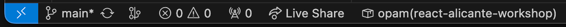
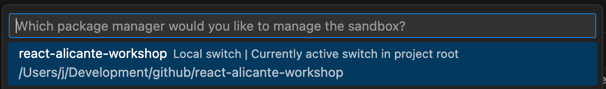

# React Alicante workshop

The project we will be working on is a feed reader that picks data from any
GitHub user profile and shows the latest actions in an ordered list. Along the
way, we will learn about OCaml, how to write React components using ReasonReact,
exploring Melange libraries, data fetching, and more. Let's get started!

## Step 0 (to be completed before the workshop)

In order to start working on the project, you will need:

### 0.1: Node and npm

While Melange provides a way to compile OCaml code into JavaScript, we will
 still be using JavaScript tools like esbuild, or download npm libraries like
`react`.

To download Node and npm, follow the instructions [from the official
website](https://docs.npmjs.com/downloading-and-installing-node-js-and-npm).
Note that while other package managers and runtimes might work, we have not
tested the workshop code with them, so we recommend to stick with these two.

### 0.2: opam

> **ℹ️ Windows users only:** Ensure you execute the following commands within
> WSL (Windows Subsystem for Linux). Follow [these
> steps](https://learn.microsoft.com/en-us/windows/wsl/install) to set up WSL.

We need [opam](https://opam.ocaml.org/), the OCaml Package Manager. There are
many ways to [install](https://opam.ocaml.org/doc/Install.html) it depending on
your platform, but let's go with the simplest method:

```shell
bash -c "sh <(curl -fsSL https://raw.githubusercontent.com/ocaml/opam/master/shell/install.sh)"
opam init
```

While `opam init` is running, it will prompt you with something like

```
Do you want opam to modify ~/.zshrc? [N/y/f]
```

Type `y` to agree.

> **Warning**
> 
> If it asks
> 
> ```
> Do you want opam to modify ~/.profile? [N/y/f]
> ```
> 
> You should enter `f` and then enter `~/.bashrc` as the file to be modified.
> There's a [bug when installing the shell hook when running Bash or Bourne
> shell](https://github.com/ocaml/opam/issues/5819).

#### Verify `opam` installation

After the installation completes, run

```shell
opam switch
```

You should see something like this:

```
#  switch                                                            compiler                                             description
→  /Users/j/Development/github/react-alicante-workshop               ocaml-base-compiler.5.2.0,ocaml-options-vanilla.1    ocaml-base-compiler = 5.2.0 | ocaml-system = 5.2.0

[NOTE] Current switch has been selected based on the current directory.
       The current global system switch is 5.2.0.
```

If you see this message at the bottom, then the shell hook wasn't installed
correctly:

```
[WARNING] The environment is not in sync with the current switch.
          You should run: eval $(opam env)
```

To get rid of the warning, you should run setup again:

```shell
opam init --reinit
```

Then follow the instructions for the warning section above.

### 0.3: Clone the repository

From the terminal:

```sh
git clone https://github.com/ahrefs/react-alicante-workshop
cd react-alicante-workshop
```

### 0.4: Install all dependencies

Proceed to run `npm run init` in order to download the workshop required
packages from both npm and opam repositories.

> [!IMPORTANT]
> 
> This process will download, build and install the OCaml compiler, so it can
> take at least 5 minutes or more, depending on the laptop and network capacity.

### Step 0 completion check

Once all dependencies are installed, you should be able to run `npm run build`
successfully.

If you run into any issues, don't fret. We will have a dedicated time at the
beginning of the workshop to make sure everyone has the working environment
correctly set up.

## Step 1: Setting up the editor environment

### 1.1: Install VSCode

We will be using VSCode, which you can install from
https://code.visualstudio.com/Download.

> **ℹ️ Windows users only:** Install the [WSL extension for
> VSCode](https://marketplace.visualstudio.com/items?itemName=ms-vscode-remote.remote-wsl).

### 1.2: Install OCaml platform extension

Install the [OCaml platform
extension](https://marketplace.visualstudio.com/items?itemName=ocamllabs.ocaml-platform).

### 1.3: Select the workshop sandbox

At the bottom of the VSCode window, you should see
`opam(react-alicante-workshop)`:



If that's not the case, click on that 📦 button, and select
`react-alicante-workshop` from the list that will appear:



### Step 1 completion check

To make sure everything is working correctly, you should be able to hover over
`querySelector` in `App.re` and see its type definition: `string =>
option(Dom.element)`. If that's the case, go to definition and all other editor
features should work. We're now ready to start coding!

## Step 2: Our first ReasonReact component

### 2.1: Development commands

To keep things organized while working on the project, we'll use two separate
terminals:

- **Terminal 1:** Run `npm run watch` to monitor the build process and catch any
  OCaml build errors.
- **Terminal 2:** Run `npm run serve` to start a local web server using
  [esbuild](https://esbuild.github.io/api/#serve).

With both commands running, you should be able to access the workshop's local
website at http://localhost:8080/. Now, we can start improving the code.

### 2.2: OCaml modules

OCaml organizes code into [modules](https://reasonml.github.io/docs/en/module).
Each file is automatically a module, and they can also contain nested modules
inside. To see this in action, we’ll move the code for the welcoming message
into a new file, `Hello.re`.

To use the code in `Hello.re` from the main `App.re`, we will have to create a
new component. In ReasonReact, components are just OCaml modules with a `make`
function annotated with the `@react.component`
[attribute](https://ocaml.org/manual/5.2/attributes.html).

> Hint: In order to create this new component, take the `h1` and `h2` from
> `App.re`, and move them to a new file `Hello.re` wrapping them with a fragment
> `<>` and a `make` function. Then use the new component from `App` using
> [JSX](https://reasonml.github.io/docs/en/jsx): `<Hello />`.

### Step 2 completion check

We only did a small refactor, so the build tab running `npm run build` should
show no errors, and the local page under http://localhost:8080/ should look like
it did before starting this step.

## Project layout

The following is a high level view of your project and application. Many of
these files will contain additional comments, explanations, examples, and help
for learning and getting started with OCaml, Reason, and Melange.

```
react-alicante-workshop
├── src
│   │   // This is a ReasonReact Component and the entry point to your application
│   └── App.re
│
│   // This directory is generated by 'Dune', OCaml's build tool.
│   // It contains compiled files and other artifacts from the build process.
│   // Note: This is _not_ where your application bundle/output/dist will be.
├── _build/
│
│   // This directory is created by `Opam`, OCaml's package manager. It
│   // contains your "local switch" and packages for your OCaml
│   // environment, specific to this project. You can think of the `_opam`
│   // folder and switches as OCaml's `node_modules`.
├── _opam/
│
│   // This is where your applications bundle or output will be located after
│   // running `npm run build`.
├── dist/
│
│   // This `dune` file configures Dune's build rules.
├── dune
│
│   // This file contains the Dune's global settings.
├── dune-project
│
├── esbuild.mjs
├── index.html
├── package-lock.json
├── package.json
│
│   // It contains opam dependencies. It is similar to `package.json`. In the
|   // near future, `Dune` and `Opam` will be more tightly integrated.
├── react-alicante-workshop.opam
│
├── README
└── node_modules/
```

## Installing Melange packages

To install dependencies, we are going to use `opam`. You can search for
dependencies and packages on [OCaml.org](https://ocaml.org/packages/search?q=).

There are [some
requirements](https://discuss.ocaml.org/t/whats-possible-with-melange/13806/3)
to use a package with `Melange` you should read about. That being said, once you
find a package you want to install you can do the following steps:

1. Add the library to the `opam` section
2. Run the following command: `npm run install:opam`

## Getting Help

- [Melange for React Devs](https://react-book.melange.re/) - This is an amazing
resource for learning Melange, OCaml, and Reason even if you're not using React
- [OCaml official site](https://ocaml.org)
- [Reason official site](https://reasonml.github.io/)
- [Melange official site](https://melange.re)
- [Melange playground](https://melange.re/v4.0.0/playground/) - Useful to share
  snippets or errors
- [OCaml Discuss Forums](https://discuss.ocaml.org/)
- [OCaml Discord Server](https://discord.gg/Qpzjmc4t)
- [Reason Discord Server](https://discord.gg/jPEH58TU)

