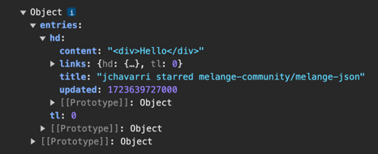

# React Alicante workshop

The project we will be working on is a feed reader that picks data from any
GitHub user profile and shows the latest actions in an ordered list. Along the
way, we will learn about OCaml, how to write React components using ReasonReact,
exploring Melange libraries, data fetching, and more. Let's get started!

## Step 0 (to be completed before the workshop)

In order to start working on the project, you will need:

### 0.1: Node and npm

While Melange provides a way to compile OCaml code into JavaScript, we will
 still be using JavaScript tools like esbuild, or download npm libraries like
`react`.

To download Node and npm, follow the instructions [from the official
website](https://docs.npmjs.com/downloading-and-installing-node-js-and-npm).
Note that while other package managers and runtimes might work, we have not
tested the workshop code with them, so we recommend to stick with these two.

### 0.2: opam

> **ℹ️ Windows users only:** Ensure you execute the following commands within
> WSL (Windows Subsystem for Linux). Follow [these
> steps](https://learn.microsoft.com/en-us/windows/wsl/install) to set up WSL.

We need [opam](https://opam.ocaml.org/), the OCaml Package Manager. There are
many ways to [install](https://opam.ocaml.org/doc/Install.html) it depending on
your platform, but let's go with the simplest method:

```shell
bash -c "sh <(curl -fsSL https://raw.githubusercontent.com/ocaml/opam/master/shell/install.sh)"
opam init
```

While `opam init` is running, it will prompt you with something like

```
Do you want opam to modify ~/.zshrc? [N/y/f]
```

Type `y` to agree.

> [!WARNING]
> 
> If it asks
> 
> ```
> Do you want opam to modify ~/.profile? [N/y/f]
> ```
> 
> You should enter `f` and then enter `~/.bashrc` as the file to be modified.
> There's a [bug when installing the shell hook when running Bash or Bourne
> shell](https://github.com/ocaml/opam/issues/5819).

#### Verify `opam` installation

After the installation completes, run

```shell
opam switch
```

You should see something like this:

```
#  switch                                                            compiler                                             description
→  /Users/j/Development/github/react-alicante-workshop               ocaml-base-compiler.5.2.0,ocaml-options-vanilla.1    ocaml-base-compiler = 5.2.0 | ocaml-system = 5.2.0

[NOTE] Current switch has been selected based on the current directory.
       The current global system switch is 5.2.0.
```

If you see this message at the bottom, then the shell hook wasn't installed
correctly:

```
[WARNING] The environment is not in sync with the current switch.
          You should run: eval $(opam env)
```

To get rid of the warning, you should run setup again:

```shell
opam init --reinit
```

Then follow the instructions for the warning section above.

### 0.3: Clone the repository

From the terminal:

```sh
git clone https://github.com/ahrefs/react-alicante-workshop
cd react-alicante-workshop
```

### 0.4: Install all dependencies

Proceed to run `npm run init` in order to download the workshop required
packages from both npm and opam repositories.

> [!IMPORTANT]
> 
> This process will download, build and install the OCaml compiler, so it can
> take at least 5 minutes or more, depending on the laptop and network capacity.

### Step 0 completion check

Once all dependencies are installed, you should be able to run `npm run build`
successfully.

If you run into any issues, don't fret. We will have a dedicated time at the
beginning of the workshop to make sure everyone has the working environment
correctly set up.

## Step 1: Setting up the editor environment

### 1.1: Install VSCode

We will be using VSCode, which you can install from
https://code.visualstudio.com/Download.

> **ℹ️ Windows users only:** Install the [WSL extension for
> VSCode](https://marketplace.visualstudio.com/items?itemName=ms-vscode-remote.remote-wsl).

### 1.2: Install OCaml platform extension

Install the [OCaml platform
extension](https://marketplace.visualstudio.com/items?itemName=ocamllabs.ocaml-platform).

### 1.3: Select the workshop sandbox

At the bottom of the VSCode window, you should see
`opam(react-alicante-workshop)`:


If that's not the case, click on that 📦 button, and select
`react-alicante-workshop` from the list that will appear:


### Step 1 completion check

To make sure everything is working correctly, you should be able to hover over
`querySelector` in `App.re` and see its type definition: `string =>
option(Dom.element)`. If that's the case, go to definition and all other editor
features should work. We're now ready to start coding!

## Step 2: Our first ReasonReact component

### 2.1: Development commands

To keep things organized while working on the project, we'll use two separate
terminals:

- **Terminal 1:** Run `npm run watch` to monitor the build process and catch any
  OCaml build errors.
- **Terminal 2:** Run `npm run serve` to start a local web server using
  [esbuild](https://esbuild.github.io/api/#serve).

With both commands running, you should be able to access the workshop's local
website at http://localhost:8080/. Now, we can start improving the code.

### 2.2: OCaml modules

OCaml organizes code into [modules](https://reasonml.github.io/docs/en/module).
Each file is automatically a module, and they can also contain nested modules
inside. To see this in action, we’ll move the code for the welcoming message
into a new file, `Hello.re`.

To use the code in `Hello.re` from the main `App.re`, we will have to create a
new component. In ReasonReact, components are just OCaml modules with a `make`
function annotated with the `@react.component`
[attribute](https://ocaml.org/manual/5.2/attributes.html).

> Hint: In order to create this new component, take the `h1` and `h2` from
> `App.re`, and move them to a new file `Hello.re` wrapping them with a fragment
> `<>` and a `make` function. Then use the new component from `App` using
> [JSX](https://reasonml.github.io/docs/en/jsx): `<Hello />`.

### Step 2 completion check

We only did a small refactor, so the build tab running `npm run build` should
show no errors, and the local page under http://localhost:8080/ should look like
it did before starting this step.

## Step 3: Modeling data

To build our GitHub activity feed reader, we'll eventually fetch data from this
endpoint: [https://gh-feed.vercel.app/api](https://gh-feed.vercel.app/api).

This endpoint doesn’t require API keys and works as follows:
- It accepts two query parameters: `user` (a `string`) and `page` (an `int`).
  For example: `https://gh-feed.vercel.app/api?user=jchavarri&page=1`
- It returns an object (let's call it `feed`) with a key `entries`, which is an
  array of feed entries. Each entry has the following structure:
  - **id**: The id of the entry (`string`).
  - **content**: The content of the entry, contains HTML as a string (optional).
  - **links**: An array of associated links, each with:
    - **href**: The URL the link points to (`string`).
    - **title**: The link title or description (`string`).
  - **title**: The entry title (`string`).
  - **updated**: A timestamp of the last update (`float`).

> [!NOTE]
> 
> There are other keys in the returned data, but we will ignore them for
> simplicity.

In this step, we’ll define some OCaml types to represent this data in our
application. Refer to the Reason documentation for details:
- [Records](https://reasonml.github.io/docs/en/record) are used to represent the
  JSON objects
- [Arrays](https://reasonml.github.io/docs/en/basic-structures#array)
- [Options](https://reasonml.github.io/docs/en/option)

We will need:
- A type `link` (i.e. `type link = ...`)
- A type `entry`
- A type `feed`

> [!TIP]
> 
> Create a new file `Feed.re` to keep these type definitions separate from the
> UI code. As we saw before, we are able to use its values from other modules by
> namespacing it, e.g. `Feed.foo`.

### Step 3 completion check

Ensure your application builds successfully (`Success` in the `npm run watch`
terminal). We may need to adjust these types later when we decode the data.

## Step 4: Decoding data (the hard way)

Once you have these types defined, we will be adding some code to take the
values from the JSON and decode them into values of the types we have defined.

First, install the
[melange-json](https://github.com/melange-community/melange-json) library:

```sh
opam install melange-json
```

Then, modify the `libraries` field in the `src/dune` file to include
`melange-json`:

```dune
(libraries melange-json reason-react)
```

Now we’re ready to decode JSON into our types. Add a `Decode` module inside
`Feed.re` with the following code:

```reason
module Decode = {
  let link = json =>
    Json.Decode.{
      href: json |> field("href", string),
      title: json |> field("title", string),
    };
  let entry = json =>
    Json.Decode.{
      content: json |> optional(field("content", string)),
      id: json |> optional(field("id", string)),
      links: json |> field("links", array(link)),
      title: json |> field("title", string),
      updated: json |> field("updated", float),
    };

  let feed = json =>
    Json.Decode.{entries: json |> field("entries", array(entry))};
};

let data = {| {
  "entries": [
    {
      "content": "<div>Hello</div>",
      "id": "abcd1234",
      "links": [
        {
          "title": "",
          "href": "https://github.com/melange-community/melange-json"
        }
      ],
      "title": "jchavarri starred melange-community/melange-json",
      "updated": 1723639727000.0
    }
  ]
} |};

let demoFeed =
  try(Some(data |> Json.parseOrRaise |> Decode.feed)) {
  | Json.Decode.DecodeError(msg) =>
    Js.log(msg);
    None;
  };
```

This code demonstrates several key features:
- The [pipe
  operator](https://melange.re/v4.0.0/communicate-with-javascript.html#pipe-last)
  `|>` sends the value on its right as the last argument to the function on the
  left, enabling clean, step-by-step data processing.
- Local module [opens](https://reasonml.github.io/docs/en/module#local-opens)
  like `Json.Decode.{ ... }` let us simplify the code by avoiding repetitive
  module prefixes.
- Exception handling uses `try` similar to JavaScript, but with [pattern
  matching](https://reasonml.github.io/docs/en/pattern-matching) for the `catch`
  part.
- To ensure consistent return types in the exception handling, we leverage
  [optional types](https://reasonml.github.io/docs/en/option).

### Step 4 completion check

Add this debug line at the bottom of `App.re`:

```reason
Js.log(Feed.demoFeed)
```

When you open the browser to view the page, check the console for the logged
content. You should see something like this:



Next, we’ll explore an easier way to decode data from JSON.

## Step 5: Decoding data (the easy way)

Manually writing the `Decode` module, as we did earlier, might not be the best
use of our time. This kind of code can be automatically derived from the type
definitions, and it's easy to introduce subtle mistakes that lead to runtime
errors.

Fortunately, OCaml provides a mechanism for generating new code from existing
code, known as "preprocessor extensions" or
[PPXs](https://ocaml.org/docs/metaprogramming).

OCaml allows us to decorate code with attributes, which look like this:
`[@foo]`. These attributes can be attached to expressions, functions, or types
to trigger specific code transformations. For example:

```reason
[@foo]
let x = 1;
```

Or, with a type definition:

```reason
[@foo]
type t = {
  name: string,
  age: int,
};
```

PPXs will pick up this attribute at compilation time and make syntactic
modifications to the code. You can think of PPXs as similar to Babel plugins in
JavaScript, which perform transformations during the build process.

If you want to read more about PPXs, [this
article](https://tarides.com/blog/2019-05-09-an-introduction-to-ocaml-ppx-ecosystem/)
provides a great introduction.

> [!TIP]
> 
> You might have noticed that these attributes look similar to the ones used to
> define components. That's right! ReasonReact is also a PPX, and decorators
> like `[@react.component]` are used to generate additional code automatically.

To generate our decoders automatically, we will use the PPX included with
`melange-json`, which we installed in the previous step.

First, modify the `preprocess` field in the `src/dune` file to include
`melange-json.ppx`:

```dune
 (preprocess
  (pps melange.ppx melange-json.ppx reason-react-ppx))
```

Then, annotate all types in `Feed.re` with `[@deriving json]`, for example:

```reason
[@deriving json]
type link = {
  href: string,
  title: string,
};
```

Next, we need to bring in the functions that decode primitive types like
`string` or `int`, such as `string_of_json`. Since there are quite a few of
these functions, it’s practical to
[open](https://reasonml.github.io/docs/en/module#opening-modules) the module and
make all its functions available within the scope of the `Feed` module. You can
do this by adding this line at the top of `Feed.re`:

```reason
open Ppx_deriving_json_runtime.Primitives;
```

> [!WARNING]
> 
> In most cases, `open` should not be used at the top level of a module. It’s
> usually better to use a [local
> open](https://reasonml.github.io/docs/en/module#local-opens) which limits the
> scope of the opened module’s functions to a specific function or submodule.

Now, you can remove the entire `Decode` module, as conversion functions like
`feed_to_json` and `feed_of_json` are generated automatically by the PPX.

Finally, modify the `demoFeed` function to use the newly generated function:

```reason
let demoFeed =
  try(Some(data |> Json.parseOrRaise |> feed_of_json)) {
  | Json.Decode.DecodeError(msg) =>
    Js.log(msg);
    None;
  };
```

### Step 5 completion check

We refactored the code to remove some manual decoding logic and introduced the
`melange-json` PPX, but the behavior remains unchanged. Open the browser console
to confirm that our debugging object is still displayed:


## Step 6: Fetching data

In this step, we'll focus on fetching data from the GitHub feed API using the
`melange-fetch` library. This will set the foundation for processing and
displaying the data in the next step.

### 6.1: Installing `melange-fetch`

First, we need to install the `melange-fetch` package, which provides bindings
for the Fetch API in OCaml.

> [!NOTE]
> 
> [Bindings](https://melange.re/v4.0.0/communicate-with-javascript.html) refer
> to the interfaces that allow OCaml code to interact with JavaScript APIs. They
> act as a bridge, enabling you to call JavaScript functions and use JavaScript
> objects directly within your OCaml code, as if they were native OCaml
> functions or types. You can write bindings manually yourself, or import
> bindings from existing libraries, like we are doing here with `melange-fetch`.

Run the following command in your terminal:

```sh
opam install melange-fetch
```

Remember to add `"melange-fetch"` to the `depends` field in your `.opam` file as
well:

```
depends: [
  ...
  "melange-fetch"
]
```

### 6.2: Adding `melange-fetch` to Dune

Next, we need to tell Dune to include this library in our project. Open the
`src/dune` file and add `melange-fetch` to the `libraries` field:

```dune
(libraries melange-fetch melange-json reason-react)
```

### 6.3: Fetching data from the API

Now that we have everything set up, let's fetch data from the feed API. Here’s
how you can use `melange-fetch` to make a request inside an effect, you can add
this for now in the `App.re` component:

```reason
module P = Js.Promise;
React.useEffect0(() => {
  Fetch.fetch("https://gh-feed.vercel.app/api?user=jchavarri&page=1")
  |> P.then_(Fetch.Response.text)
  |> P.then_(text => Js.log(text) |> P.resolve)
  |> ignore;
  None;
});
```

This snippet does the following:
- **`module P = Js.Promise`**: Adds a module alias `P` to the Melange API module
  [Js.Promise](https://melange.re/v4.0.0/api/ml/melange/Js/Promise/index.html).
- **`React.useEffect0`**: Runs the fetch operation when the component mounts.
  The `useEffect0` function is a binding defined [in
  reason-react](https://reasonml.github.io/reason-react/docs/en/useeffect-hook#docsNav).
- **`Fetch.fetch(url)`**: Initiates a GET request to the specified URL.
- **`P.then_(Fetch.Response.text)`**: Converts the response into a text string.
- **`P.then_(text => Js.log(text) |> P.resolve)`**: Logs the response text to
  the console.
- **`ignore`**:
  [Discards](https://reasonml.github.io/api/Stdlib.html#1_Unitoperations) the
  final promise result since we're only interested in side effects.

> [!TIP]
> 
> Chaining promises with `then_` allows you to handle asynchronous code in a
> structured way, similar to how you'd do it in JavaScript. We will see later on
> a different way to handle asynchronous code, that is closer to `async/await`.

### 6.4: Step 6 completion check

Run your application to ensure that the data is being fetched correctly. Check
your console to see the printed data. If everything is working, you should see
the raw JSON data in your console.

If everything works well, now it's a good time to clean up some of the previous
prototyping code that we are not using anymore: `Feed.data`, `Feed.demoFeed` and
the `Js.log(Feed.feed_of_json);` line at the end of `App.re`.

## Step 7: Displaying data

Now that we have successfully fetched the data, let’s move on to decoding it and
displaying it in the UI.

### 7.1: Decoding the fetched data

We need to decode the raw data using our `feed_of_json` function. First of all,
we are going to define a new variant type to specify the state of the UI:

```reason
type loadingStatus =
  | Loading
  | Loaded(result(Feed.feed, string));
```

This type uses a few things:
- [Variant types](https://reasonml.github.io/docs/en/variant), similar to enums
- Result type, which is a predefined variant with two options: `Ok` and `Error`
- In this case, the "Ok" part is the `feed` type we defined in the previous
  step, and the error type is just a string

Now we can adapt the effect in `App.re` to use the new type. We will also be
adding a `useState` hook to store the data loading state:


```reason
/* inside the App component `make` function */
    let (data, setData) = React.useState(() => Loading);
    React.useEffect0(() => {
      Js.Promise.(
        Fetch.fetch("https://gh-feed.vercel.app/api?user=jchavarri&page=1")
        |> then_(Fetch.Response.text)
        |> then_(text =>
             {
               let data =
                 try(Ok(text |> Json.parseOrRaise |> Feed.feed_of_json)) {
                 | Json.Decode.DecodeError(msg) =>
                   Js.Console.error(msg);
                   Error("Failed to decode: " ++ msg);
                 };
               setData(_ => Loaded(data));
             }
             |> resolve
           )
      )
      |> ignore;
      None;
    });
```

### 7.2: Rendering the data in the UI

With the data decoded, it’s time to display it in the UI. Update your React
component to process the result and render the feed:

```reason
  {switch (data) {
    | Loading => <div> {React.string("Loading...")} </div>
    | Loaded(Error(msg)) => <div> {React.string(msg)} </div>
    | Loaded(Ok(feed)) =>
      <div>
        <h1> {React.string("GitHub Feed")} </h1>
        <ul>
          {feed.entries
          |> Array.map((entry: Feed.entry) =>
                <li key={entry.id}>
                  <h2> {React.string(entry.title)} </h2>
                </li>
              )
          |> React.array}
        </ul>
      </div>
    }}
```

Note how we leverage pattern matching (`switch`) together with variants to map
the data state directly to the UI.

Also, unlike in JavaScript, plain strings cannot be used directly as React
elements in ReasonReact; they need to be converted using `React.string`.

Lastly, we use specific type annotations in `Array.map` (e.g., `Feed.link`) to
assist the compiler in inferring the correct type within the callback. This
isn’t always necessary, but it’s often required in mapping functions due to the
way type inference and piping work in OCaml.

### 7.3: Step 7 completion check

Reload your application, and you should now see the GitHub feed displayed on the
page. The data is fetched, decoded, and rendered dynamically. If everything
works, the console should be free of errors, and the feed should be visible.

Can you try updating the rendering function to also show `entry.content` and
`entry.links`? 

> [!TIP]
>
> You might need to use `switch` and the `dangerouslySetInnerHTML` prop for
> `entry.content`, and `Array.map` for `entry.links`.

## Step 8: Using input fields to get data for any user

In this step, we'll enhance our app by letting users enter a GitHub username to
fetch and display their activity feed.

To achieve this, we'll need to make a few updates to our app: add an input for
the username, store the username, make the request to get the user's feed and
make sure the UI gets updated.

Let's start: we will add a new state hook to store the `username`. We can use
`React.useState`, which we have already seen before.

Then, we will add an input field to capture the GitHub username. Let's use the
`onKeyDown` event to listen for the `Enter` key press, and add a label for
clarity. We also have to ensure that the input value is bound to the `username`
state:

```reason
<div>
  <label htmlFor="username-input"> {React.string("Username:")} </label>
  <input
    id="username-input"
    value=username
    onChange={event => {
      setUsername(event->React.Event.Form.target##value)
    }}
    onKeyDown={event =>
      let enterKey = 13;
      if (React.Event.Keyboard.keyCode(event) == enterKey) {
        setData(_ => Loading);
        fetchFeed(username);
      }
    }
    placeholder="Enter GitHub username"
  />
</div>
```

Finally, we have to modify our data fetching logic to get data for the current
user. This will involve the following steps:

- Remove the previous effect and move its content to a new function `fetchFeed`,
  which will take a `username` of type `string` and perform the network request
  to get data for that user. You'll need to dynamically insert the `username`
  into the URL using the string concatenation operator `++` (see the [syntax
  cheatsheet](https://reasonml.github.io/docs/en/syntax-cheatsheet)).
- To get the initial data when the component first mounts, create a new effect
  that runs at initialization (`useEffect0`) and calls `fetchFeed(username)`:
```reasonml
React.useEffect0(() => {
  fetchFeed(username);
  None;
});
```

### Step 8 completion check

After this step is completed, we should be able to type a valid username like
`xavierleroy` and see their most recent activity on GitHub appearing in the
feed.

Don't worry about data validation or error handling for now, we will fix that in
the next step.

## Step 9: Validating data with abstract modules, handling edge cases and errors

### 9.1: Validate usernames

Right now, we can enter any kind of string in our input, but GitHub only allows
usernames with specific rules:
- Max length should be 39 characters
- Can only contain alphanumeric characters and dashes `-`
- Can't start or finish with dash `-`

Let's add some logic to validate the username. As the `App.re` module is getting
large already, let's create a new module `Username.re`. In this module, we will
define the following:

- `type t = string;`
- A function `make` that takes a `string` and returns a `result` value:
```reason
let make = (username: string) => {
  let re = [%re "/^[a-zA-Z0-9](?:[a-zA-Z0-9-]{0,37}[a-zA-Z0-9])?$/"];
  Js.Re.test(~str=username, re) ? Ok(username) : Error();
};
```
- A `toString` function that converts `Username.t` back to a string.

To make sure we can't use any string as validated username incorrectly, we will
make the type `t`
[abstract](https://courses.cs.cornell.edu/cs3110/2021sp/textbook/modules/abstract_types.html),
In order to do so, we will add an [interface
file](https://reasonml.github.io/docs/en/module#interface-files). These files
define how the module types will be visible from the outside.

So let's create a new file `Username.rei` with this content:

```reasonml
type t;

let make: string => result(t, unit);

let toString: t => string;
```
Note how we are leaving `t` without a definition, this makes the type abstract.
This way, every time we need to use a GitHub username in our app, we can use
`Username.t` as a type, and this will guarantee that the string has gone through
the validation before being used in the function.

To use the new type, we will modify the existing `App` component.

First of all, we will replace `loadingStatus` with another type that reflects
all the potential states that our component can be in. We need to store the
username as we did before, and we also want to track all potential errors, so we
will define the `state` as a record, with two fields `username` and `step`. The
latter will define the steps of our UI component, as if it was modeled as a
state machine:

```reasonml
type step =
  | Idle /* There is no request going on, and no data to be shown. In this case, we will just show instructions to proceed with the request. */
  | Loading /* A request is currently taking place to fetch the feed. */
  | InvalidUsername /* The entered username is not a valid GitHub ID. */
  | Loaded(result(Feed.feed, string)); /* A request has finished, its result is contained inside the variant value itself. */

type state = {
  username: string,
  step,
};
```

After this, we will replace the two state hooks that were using for `data` and
`username` with a single one that handles this new state:

```reasonml
  let (state, setState) =
    React.useState(() => {username: "jchavarri", step: Idle});
```

Let's modify `fetchFeed` to take a value of type `Username.t` rather than
`string`, so we make sure there are no requests being done with invalid
usernames. This essentially consists on replaing `username` with
`Username.toString(username)`, in order to convert back to string when building
the URL.

Now, let's start thinking which parts of our component will modify the state:
- When we call `fetchFeed`, we have to set `step` to `Loading` at the beginning
  of the function (`setState(state => {...state, step: Loading});`), and
  `Loaded` when the request has finished (`setState(state => {...state, step:
  Loaded(data)})`)
- When the input value changes, we will go back to step `Idle`:
```reasonml
  onChange={event => {
    setState(_ =>
      {username: event->React.Event.Form.target##value, step: Idle}
    )
  }}
```
- We validate the username on `Enter` to ensure only valid requests are sent. If
  the name is valid, we can just call `fetchFeed`, but if it's invalid, we will
  set the step to `InvalidUsername`:
```reasonml
  onKeyDown={event => {
    let enterKey = 13;
    if (React.Event.Keyboard.keyCode(event) == enterKey) {
      switch (Username.make(state.username)) {
      | Ok(username) => fetchFeed(username)
      | Error () =>
        setState(state => {...state, step: InvalidUsername})
      };
    };
  }}
```

To continue, we have to adapt the effect to check the username is valid:

```reasonml
  React.useEffect0(() => {
    switch (Username.make(state.username)) {
    | Ok(username) => fetchFeed(username)
    | Error () =>
      Js.Exn.raiseError(
        "Initial username passed to React.useState is invalid",
      )
    };
    None;
  });
```

Finally, we can modify the `switch` in the JSX code to use the new state, so
instead of checking `data` we check for `state.step`:

```reasonml
  {switch (state.step) {
    | InvalidUsername => <div> {React.string("Invalid username")} </div>
    | Idle =>
      <div>
        {React.string(
          "Press the \"Enter\" key to confirm the username selection.",
        )}
      </div>
    | Loading => <div> {React.string("Loading...")} </div>
    | Loaded(Error(msg)) => <div> {React.string(msg)} </div>
    | Loaded(Ok(feed)) => ...
  }}
```

### 9.2: Handle edge cases and errors

To improve the user experience, we'll add messages for the following cases:
- when there are errors returned by the server
- or when a valid user has an empty feed

For this, we will have to modify `App` component in a couple of places.

The `fetchFeed` function should check for the response status using
`Fetch.Response.status`. If the status is 200, then proceed as before, but if
it's something else, it should call `setData(_ => Loaded(Error("Error: Received
status " ++ string_of_int(status))))`.

The code should roughly look like this:

```reasonml
Fetch.fetch(...)
|> P.then_(response => {
      let status = Fetch.Response.status(response);
      if (status === 200) {
        /* If status is OK, proceed to parse the response */
        response
        |> Fetch.Response.text
        |> P.then_(...);
      } else {
        /* Handle non-200 status */
        setState(state =>
          {
            ...state,
            step:
              Loaded(
                Error(
                  "Error: Received status " ++ string_of_int(status),
                ),
              ),
          }
        )
        |> P.resolve;
      };
    })
|> ignore;
```

> [!TIP]
> 
> You can use either `if` / `else` or a `switch` expression for this.

The other change involves the rendering logic. We will have to modify the
content of the `ul` element, so that instead of always iterating over the array
of entries, we should use a `switch (feed.entries)` check. In case the array is
empty, we can just render `React.string("This user feed is empty")`.

With these two modifications, our app is a bit more user friendly.

### Step 9 completion check

To test these changes, we can type a username like `in` to see the empty feed
message. Testing with invalid usernames like `invalid-` will display an invalid
username message, while nonexistent usernames like `a---1` will show a server
error message (this user doesn't exist, but this case is currently not handled
by the API server).

## Project layout

The following is a high level view of your project and application. Many of
these files will contain additional comments, explanations, examples, and help
for learning and getting started with OCaml, Reason, and Melange.

```
react-alicante-workshop
├── src
│   │   // This is a ReasonReact Component and the entry point to your application
│   └── App.re
│
│   // This directory is generated by 'Dune', OCaml's build tool.
│   // It contains compiled files and other artifacts from the build process.
│   // Note: This is _not_ where your application bundle/output/dist will be.
├── _build/
│
│   // This directory is created by `Opam`, OCaml's package manager. It
│   // contains your "local switch" and packages for your OCaml
│   // environment, specific to this project. You can think of the `_opam`
│   // folder and switches as OCaml's `node_modules`.
├── _opam/
│
│   // This is where your applications bundle or output will be located after
│   // running `npm run build`.
├── dist/
│
│   // This `dune` file configures Dune's build rules.
├── dune
│
│   // This file contains the Dune's global settings.
├── dune-project
│
├── esbuild.mjs
├── index.html
├── package-lock.json
├── package.json
│
│   // It contains opam dependencies. It is similar to `package.json`. In the
|   // near future, `Dune` and `Opam` will be more tightly integrated.
├── react-alicante-workshop.opam
│
├── README
└── node_modules/
```

## Installing Melange packages

To install dependencies, we are going to use `opam`. You can search for
dependencies and packages on [OCaml.org](https://ocaml.org/packages/search?q=).

There are [some
requirements](https://discuss.ocaml.org/t/whats-possible-with-melange/13806/3)
to use a package with `Melange` you should read about. That being said, once you
find a package you want to install you can do the following steps:

1. Add the library to the `opam` section
2. Run the following command: `npm run install:opam`

## Getting Help

- [Melange for React Devs](https://react-book.melange.re/) - This is an amazing
resource for learning Melange, OCaml, and Reason even if you're not using React
- [OCaml official site](https://ocaml.org)
- [Reason official site](https://reasonml.github.io/)
- [Melange official site](https://melange.re)
- [Melange playground](https://melange.re/v4.0.0/playground/) - Useful to share
  snippets or errors
- [Reason React docs](https://reasonml.github.io/reason-react/)
- [OCaml Discuss Forums](https://discuss.ocaml.org/)
- [OCaml Discord Server](https://discord.gg/Qpzjmc4t)
- [Reason Discord Server](https://discord.gg/jPEH58TU)

